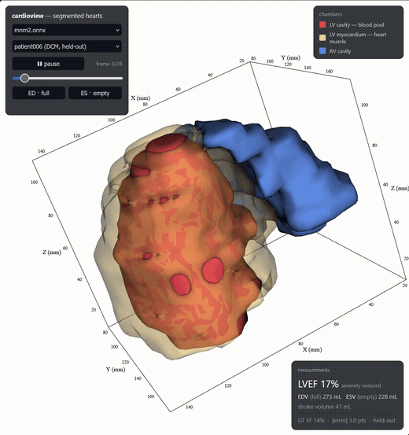
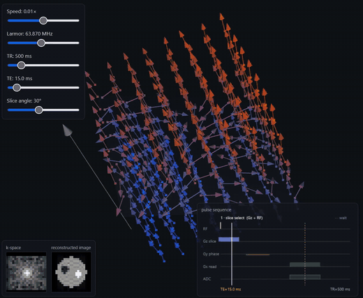

# systole — cardiac segmentation + function across MRI, CT, echo

**What this is.** systole is where I pick up a new domain in the open — one bounded problem, end
to end: cardiac **segmentation → ejection fraction**.



*The model's output on a **held-out** patient — predicted chambers (LV cavity / myocardium /
RV) as a beating 3D heart with **EDV / ESV / LVEF vs ground truth**. Drop in your own
`.nii.gz` and it segments in-browser. Interactive viewer: **[cardioview](cardioview/)**.*

Segmentation and **cardiac-function measurement (ejection fraction)** across imaging
modalities — **MRI first, CT and echo to follow** — with the evaluation rigor that
decides whether a measurement can be trusted. The connective tissue is the
computational geometry: how you go from per-voxel labels to a clinical number,
whatever the modality.

The three modalities converge on one capability (cardiac function), so they tell a
single story rather than three disjoint demos. For the full plan — the 3×3 grid
(modality × theory / data-viz / solved-problem), the geometry thread, and the
milestones — see **[ROADMAP.md](ROADMAP.md)**. The dated build log is the git
history.

**Honest scope.** I come from audio / acoustic-signal ML (end-to-end modeling, evaluation,
edge); cardiac imaging is a deliberate ramp. The approach: build the problem end-to-end,
evaluate it, and visualize it, with an **LLM-driven learning track** ([`learning/`](learning/):
theory write-ups + self-quizzes) running alongside the build — learning a field by shipping in
it. Competence built in the gap on public data, not a claim of prior medical-imaging
experience; the ramp is the point, not a disclaimer. Today only the MRI lane is underway; CT
and echo are planned, not done.

## Visualizing the physics — [mri-sim](mri-sim/)
An interactive 3D visualizer of the MRI **signal pipeline** — spins → slice select →
phase/frequency encode → k-space → reconstructed image, on one clock — built to
*understand the acquisition* the segmentation model consumes. Educational and physically
honest; a separate TS app from the Python pipeline below.



## Seeing the model work — [cardioview](cardioview/)
A browser viewer (TS + vtk.js) of the segmentation model's output on real hearts: the
predicted chambers (LV cavity / myocardium / RV) as a **beating 3D heart** over the cardiac
cycle, with **EDV / ESV / LVEF** read out against ground truth and a `held-out` honesty tag.
Inference + meshes are precomputed in Python (the [`cardioseg`](#pipeline-per-modality)
pipeline below); the web app just renders. *(demo at the top.)*

## Pipeline (per modality)
1. **Data** — modality-specific loader + normalization (e.g. ACDC short-axis cine
   MRI; NIfTI volumes with per-voxel spacing in mm).
2. **Segment** — 2D/3D U-Net (MONAI) → per-voxel labels.
3. **Measure** — chamber volumes (voxel count × voxel volume, mm³ → mL);
   **EF = (EDV − ESV) / EDV**.
4. **Evaluate** — Dice + Hausdorff per structure; **where it fails** (worst cases,
   calibration) — the part that decides clinical trust.
5. **Geometry/viz** — marching-cubes surface mesh per chamber.

## Layout
```
cardioseg/                # pipeline stages, data -> preprocess -> train -> measure
  data/
    mri/                  #   CT/, echo/ added when each is real (not before)
      data.py             #     ACDC loader (NIfTI, spacing-aware) + geometric LV/RV id
  preprocessing/
    preprocess.py         #   resample in-plane + z-score; param-keyed disk cache
  training/
    model.py              #   MONAI U-Net factory (2D/3D)
    dataset.py            #   ACDC 2D-slice dataset, patient-level split
    train.py              #   training loop (synthetic + real ACDC)
  evaluation/
    measure.py            #   chamber volumes + ejection fraction (spacing-aware)
    evaluate.py           #   Dice / Hausdorff / failure ranking
    validate.py           #   per-class Dice + EF vs GT on held-out patients
    losses.py             #   compound Dice + cross-entropy
  analysis/
    eda.py                #   ACDC reality-check + data/overlay viz
    viz.py                #   marching-cubes surface mesh
tests/
  unit/                   # pure-function units (geometry, metrics, preprocessing)
  integration/            # end-to-end on real ACDC (skips if data absent)
```

## Quickstart
```bash
pip install -e .                           # or: pip install -r requirements.txt
python -m pytest tests/ -q                 # unit + real-ACDC integration (integration skips w/o data)
```
Real data: register for ACDC (Creatis / humanheart-project). Data lives **outside
the repo** (licensing + size) under a `raw/` ↔ `processed/` split. Point at it via
`paths.yaml` (copy the template — it's gitignored, machine-specific):
```bash
cp paths.example.yaml paths.yaml      # then edit:
#   data:
#     raw: /path/to/data/raw/mri/acdc          # ACDC inputs (dir holding training/)
#     processed: /path/to/data/processed/mri/acdc   # preprocess cache (npz)
```
Loaded by `cardioseg/config.py` (OmegaConf). Env vars `CARDIAC_DATA_ROOT` /
`CARDIAC_PROCESSED_ROOT` override it (handy for CI).

### Train on real ACDC
```bash
# torch CUDA build (CPU wheel won't train); Blackwell/RTX 5090 needs torch>=2.7:
pip install torch --index-url https://download.pytorch.org/whl/cu128
python -m cardioseg.training.train --acdc --epochs 40      # writes runs/acdc/{model.pth,metrics.json}
```

## Results — first real baseline (MRI / ACDC)
2D U-Net, 40 epochs, no augmentation, `--seed 0` (reproducible). 80/20
**patient-level** split, 20 held-out patients across all five ACDC pathology
groups. *(baseline, not tuned.)* Numbers below are written by
`runs/acdc/metrics.json`.

| Structure | Val Dice | published ACDC range |
|---|---|---|
| LV cavity | **0.932** | ~0.93–0.96 |
| LV myocardium | 0.822 | ~0.88–0.92 |
| RV cavity | 0.859 | ~0.88–0.92 |
| **mean** | **0.871** | |

The right column is the *published range on ACDC* — context, not a trophy. ACDC is
single-centre and homogeneous, so matching it means "competent on a clean
benchmark," **not** state-of-the-art or clinical-grade. Real-world robustness
(multi-vendor/scanner, domain shift) is untested here and is the hard part.

**Ejection fraction vs ground truth: MAE 3.1%** (clinical equivalence ≈ ±5%).
**Where it fails:** the largest EF errors sit in the thin-walled RV and
thick-walled HCM cases (worst ≈11%), where the LV-myo / RV boundary is hardest —
exactly as the artifact/evaluation notes predicted; the well-behaved DCM group
tracks to a few percent. Closing the myo/RV Dice gap (augmentation, longer
training) is the next lever.

## How it's built
Agent-driven build, human-owned judgment — the workflow I use day to day. Coding
agents scaffold the boilerplate, loaders, and API plumbing; I own the modelling
decisions, the measurement correctness, and the evaluation. The EF/volume math is
spacing-aware and unit-checked by hand; the metrics and failure ranking are the
point. What transfers from my audio / acoustic-signal ML background is data-structure
reasoning (how data correlates along each axis → the right inductive bias) and
evaluation discipline; the clinical specifics I'm learning as I go — via a
research → theory → quiz → log circuit (see [learning/](learning/) and
[ROADMAP.md](ROADMAP.md)).
