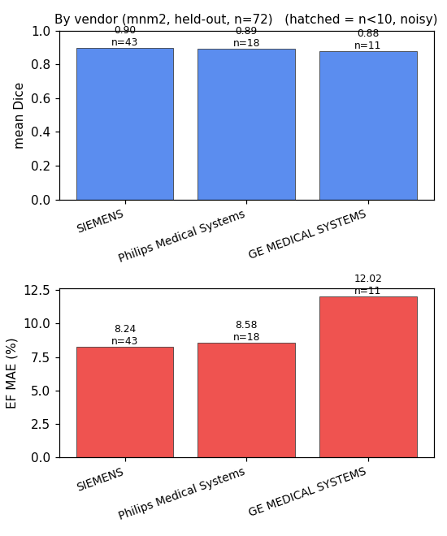

# cardioseg — the pipeline

The science layer: cardiac MRI → segmentation → ejection fraction → evaluation, set up for
**domain generalization** (train on multi-vendor **M&M-2**, test on held-out single-centre
**ACDC**). Python (PyTorch + MONAI). The browser demo ([cardioview](../cardioview/)) consumes
what this produces.

## Pipeline
1. **Data** — modality loader + normalization (ACDC short-axis cine MRI; NIfTI, spacing-aware
   in mm; geometric LV/RV disambiguation).
2. **Segment** — 2D U-Net (MONAI) → per-voxel labels (bg / RV / LV-myo / LV-cav).
3. **Measure** — chamber volumes (voxel count × voxel volume, mm³ → mL); **EF = (EDV − ESV) / EDV**.
4. **Evaluate** — Dice + HD95 / ASSD per structure + EF vs GT; **failure ranking** (the worst
   cases decide clinical trust, not the mean).
5. **Geometry/viz** — marching-cubes chamber meshes; error-distribution plots.

## Setup
```bash
pip install -e .                  # from repo root (installs cardioseg)
# torch CUDA build (CPU wheel won't train); Blackwell/RTX 5090 needs torch>=2.7:
pip install torch --index-url https://download.pytorch.org/whl/cu128
```
Data lives **outside the repo** (licensing + size). Set **one** path in `paths.yaml` and lay the
register-gated downloads under `<data>/raw/<dataset>/`:
```bash
cp paths.example.yaml paths.yaml      # then: data: /abs/path/to/cardiac-data
#   <data>/raw/acdc/      register: https://www.creatis.insa-lyon.fr/Challenge/acdc/
#   <data>/raw/mnm2/      register: https://www.ub.edu/mnms-2/
#   <data>/raw/MnM/       register: M&Ms-1  (optional, broadest multi-site set)
#   <data>/processed/     preprocess cache — auto-created, leave it alone
```
That's the only manual step. Datasets are discovered by name under `raw/`; the preprocess cache is
created on first run; per-dataset label conventions (M&M-2/M&Ms-1 have LV=1, ACDC LV=3) are
remapped to canonical on load (verified geometrically), so one model spans them. Env `CARDIAC_DATA`
overrides the file (CI). Loaded by `cardioseg/config.py`; adapters live in `cardioseg/data/mri/`
behind a `DatasetAdapter` interface (add a dataset = one file + one registry line).

## Train + evaluate
```bash
# flagship: train multi-vendor M&M-2, hold ACDC out entirely as the test set
python -m cardioseg.training.train --dataset mnm2 --test acdc   # -> runs/mnm2_to_acdc/ (128-ep ceiling, early-stops ~95)
# single-centre baseline + its OOD drop on M&M-2 (the reverse direction)
python -m cardioseg.training.train --dataset acdc --test mnm2 --epochs 40   # -> runs/acdc_to_mnm2/
python -m cardioseg.evaluation.distribution --run runs/mnm2_to_acdc   # KDE + Bland-Altman -> plots/
python -m cardioseg.training.export_onnx --run runs/mnm2_to_acdc      # model.onnx (+INT8) for the web viewer
```
Training auto-tunes for the GPU: DataLoader workers (`--workers`), mixed precision, cudnn.benchmark.

## Results (seed 0, patient-level splits)
Flagship = **M&M-2 → ACDC** (train multi-vendor, test 100 held-out single-centre patients),
with heavy augmentation + early stopping + largest-CC postprocessing + test-time augmentation:

| structure | Dice | published ACDC |
|---|---|---|
| LV cavity | **0.94** | ~0.93–0.96 |
| LV myocardium | 0.86 | ~0.88–0.92 |
| RV cavity | 0.89 | ~0.88–0.92 |
| **mean** | **0.90** | |

**EF vs GT: MAE 6.3%** (cross-dataset, bias −5.6%, 95% LoA [−21, +9]). **Diversity buys
robustness — the asymmetry proves it:**

| train → test | mean Dice | RV | EF MAE |
|---|---|---|---|
| ACDC → ACDC (in-domain) | 0.87 | 0.85 | 4.7% |
| ACDC → M&M-2 (out-of-distribution) | 0.70 | 0.59 | 9.1% |
| M&M-2 → ACDC (generalization, flagship) | 0.87 | 0.84 | 9.4% |

*Asymmetry table is the base model (identical config across directions, for a fair A/B); heavy
aug + largest-CC + TTA lift the flagship to 0.90 Dice / 6.3% EF (top table).*

- Single-centre training loses ~17 Dice points off its home dataset (RV collapses 0.85 → 0.59);
  multi-vendor training carries to a new centre with **no segmentation drop**.
- **EF transfers worse than Dice** — volume calibration shifts across centres (in-domain EF MAE
  4.7% → cross-dataset ~9%); the chambers are right, the absolute mL drift.
- **Surface metrics** (flagship eval): by Dice RV > myo, but by boundary (HD95) RV is
  *worst* (~4.2 mm) — Dice punishes the thin myo ring, RV's boundary is messy (basal slices + stray
  voxels). Full HD is the fragile max (one stray voxel → ~200 mm); **HD95** is the robust report.
- `runs/<run>/plots/`: per-class boundary-distance **KDE** + EF **Bland–Altman** (flagship below).


### Stratified — where it actually fails
Pooled numbers average over the failures. Broken down (same model, same eval; `distribution.py`
emits these + `stratified.json`):

**By pathology** (held-out ACDC) — Dice is flat (~0.90 everywhere) but **EF error is disease-specific**:

| pathology | mean Dice | EF MAE | EF bias |
|---|---|---|---|
| DCM | 0.90 | **2.2%** | −1.0% |
| MINF | 0.90 | 5.1% | −4.1% |
| NOR | 0.92 | 5.1% | −4.8% |
| RV | 0.89 | 7.8% | −7.1% |
| **HCM** | 0.91 | **11.2%** | −10.9% |

HCM (thick myocardium → hardest cavity) is the EF failure — invisible in Dice, glaring in EF.


**By vendor** (in-domain M&M-2 val) — the model is weakest on the **minority** vendor:

| vendor | n | mean Dice | EF MAE |
|---|---|---|---|
| Siemens | 43 | 0.898 | 8.2% |
| Philips | 18 | 0.893 | 8.6% |
| **GE** | 11 | **0.879** | **12.0%** |

GE (fewest training subjects) trails — the imbalance signal that motivates harmonization. Small n
(11), so directional not definitive; still, it's the measured case *for* `qfz`, not an assumption.



Published column = context, not a trophy: even multi-vendor, this is "competent on public
benchmarks," not clinical-grade. M&M-2 is 3 vendors / 1.5–3T — broader than ACDC, still not the
full deployment distribution.

## Layout
```
cardioseg/
  data/mri/base.py        # DatasetAdapter interface + shared primitives (load_nifti, labels, LV/RV id)
  data/mri/acdc.py        # ACDC adapter (canonical labels, Info.cfg meta)
  data/mri/mnm2.py        # M&M-2 adapter (multi-vendor; label_map remaps to canonical)
  data/mri/mnms1.py       # M&Ms-1 adapter (6-centre/4-vendor; 4D ED/ES + CSV)
  data/mri/registry.py    # name -> adapter (add a dataset = one file + one line)
  preprocessing/preprocess.py   # resample in-plane + z-score; param-keyed disk cache
  training/
    model.py              # MONAI U-Net factory (2D/3D)
    dataset.py            # 2D-slice dataset, patient-level split (dataset-agnostic loader)
    train.py              # training loop (--dataset acdc|mnm2, --test for cross-dataset; workers+AMP)
    export_onnx.py        # trained U-Net -> ONNX (+INT8 quant), torch-parity gated
  evaluation/
    measure.py            # chamber volumes + ejection fraction (spacing-aware)
    evaluate.py           # Dice / surface distances (HD/HD95/ASSD) / failure ranking
    validate.py           # per-class Dice + EF vs GT on held-out patients
    distribution.py       # boundary-distance KDE + EF Bland-Altman
    losses.py             # compound Dice + cross-entropy
  analysis/{eda,viz}.py   # ACDC reality-check + marching-cubes surface mesh
config.py                 # paths.yaml loader (OmegaConf)
```
Tests: `tests/unit` (geometry, metrics, preprocessing) + `tests/integration` (real ACDC, skips
if data absent).
