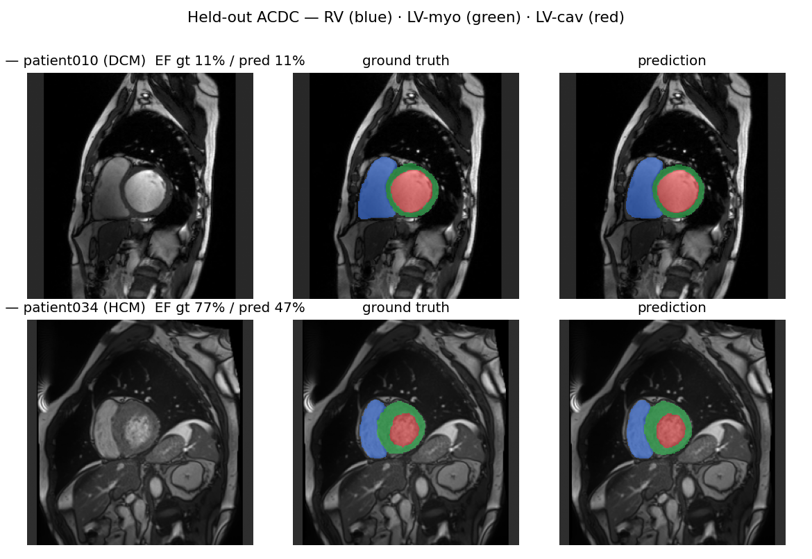
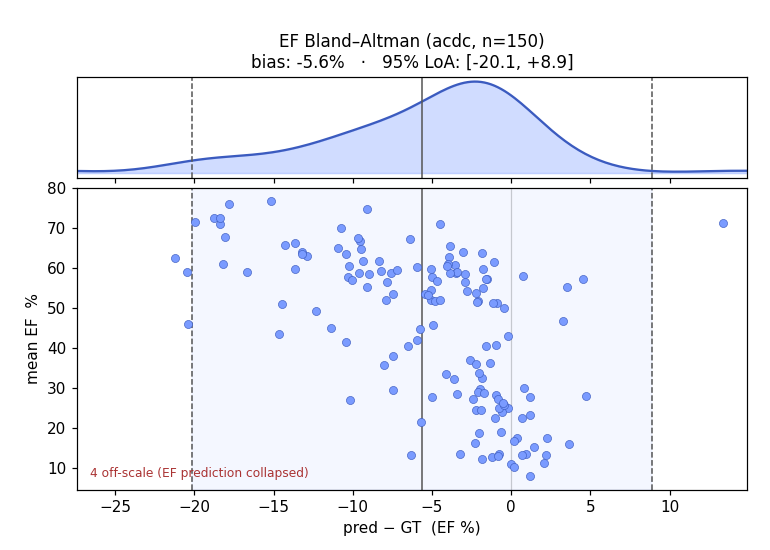
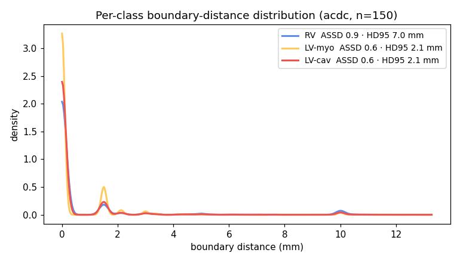
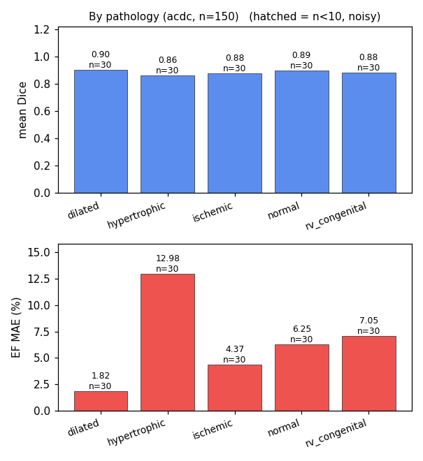
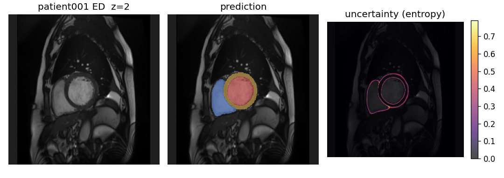

# cardioseg — the pipeline

The science layer: cardiac MRI → segmentation → ejection fraction → evaluation, set up for
**domain generalization** (train on Siemens+Philips, validate on centre-shifted **ACDC**, test on
unseen vendors **Canon+GE**). Python (PyTorch + MONAI). The browser demo ([cardioview](../cardioview/)) consumes
what this produces.



*Our model on ACDC val set (trained on Siemens+Philips from M&M-2+M&Ms-1). Top: a clean dilated heart. Bottom: the
worst hypertrophic case — small thick-walled cavities are where the end-systolic over-segmentation
bites. RV blue · LV-myo green · LV-cav red.*

## Pipeline
1. **Data** — modality loader + normalization (ACDC short-axis cine MRI; NIfTI, spacing-aware
   in mm; geometric LV/RV disambiguation).
2. **Segment** — 2D U-Net (MONAI) → per-voxel labels (bg / RV / LV-myo / LV-cav).
3. **Measure** — chamber volumes (voxel count × voxel volume, mm³ → mL); **EF = (EDV − ESV) / EDV**.
4. **Evaluate** — Dice + HD95 / ASSD per structure + EF vs GT; **failure ranking** (the worst
   cases decide clinical trust, not the mean).
5. **Geometry/viz** — marching-cubes chamber meshes; error-distribution plots.

## Setup
```bash
pip install -e .                  # from repo root (installs cardioseg)
# torch CUDA build (CPU wheel won't train); Blackwell/RTX 5090 needs torch>=2.7:
pip install torch --index-url https://download.pytorch.org/whl/cu128
```
Data lives **outside the repo** (licensing + size). Set **one** path in `paths.yaml` and lay the
register-gated downloads under `<data>/raw/<dataset>/`:
```bash
cp paths.example.yaml paths.yaml      # then: data: /abs/path/to/cardiac-data
#   <data>/raw/acdc/      register: https://www.creatis.insa-lyon.fr/Challenge/acdc/
#   <data>/raw/mnm2/      register: https://www.ub.edu/mnms-2/
#   <data>/raw/MnM/       register: M&Ms-1  (optional, broadest multi-site set)
#   <data>/processed/     preprocess cache — auto-created, leave it alone
```
That's the only manual step. Datasets are discovered by name under `raw/`; the preprocess cache is
created on first run; per-dataset label conventions (M&M-2/M&Ms-1 have LV=1, ACDC LV=3) are
remapped to canonical on load (verified geometrically), so one model spans them. Env `CARDIAC_DATA`
overrides the file (CI). Loaded by `cardioseg/config.py`; adapters live in `cardioseg/data/mri/`
behind a `DatasetAdapter` interface (add a dataset = one file + one registry line).

## Data cloud
Data = scans + metadata in one homogeneous **store**. Per-dataset **adapters**
(`data/mri/{acdc,mnm2,mnms1}.py` behind a `DatasetAdapter` interface) read raw→canonical; `data/store.py`
consolidates each into a self-contained processed set mirroring `raw/`:

```
processed/<dataset>/<paramkey>/        # paramkey = inplane1p5 | inplane1p5_n4
    data/<subject>.npz                 # resampled + z-scored ed/es img+gt + spacing
    meta.csv                           # common schema (read with polars)
```

`store.load(names)` ensures each is processed (builds if the folder is missing) then returns **one
polars frame** over them — concatenating the per-dataset `meta.csv` *is* the data cloud (no separate
inventory). **Splits are queries over it** (`data/splits.py`): roles aren't baked into datasets. We
pull **all** data and make our **own** splits — challenge splits aren't inherited.

```bash
python -m cardioseg.data.store                 # consolidate all + print the cloud summary
python -m cardioseg.training.train             # train; default split holds out ACDC + Canon (criteria)
```

| dataset | n | vendors | demographics | role |
|---|---|---|---|---|
| **ACDC** | 150 (train 100 + test 50, both labelled) | Siemens only | height/weight → BSA | **val** (centre/protocol shift; early stopping + calibration) |
| **M&M-2** | 360 | Siemens 219 / Philips 88 / GE 53 | — | train (Siemens+Philips only; GE excluded from train) |
| **M&Ms-1** | 320 on disk / **213 labelled** | Philips 125 / Siemens 95 / GE 50 / **Canon 50** (9 labelled) | age / sex / h+w | train (Siemens+Philips); **Canon+GE = unseen-vendor test** (held out entirely) |

**Unification** each adapter handles: label remap to canonical (0 bg / 1 RV / 2 myo / 3 LV-cav —
M&M-2 & M&Ms-1 are LV=1, verified geometrically); ED/ES selection; `meta()` parsing of acquisition +
demographics from the dataset's own sidecars (Info.cfg / CSV). `null` is a valid value (unknown).

**Stratification axes** (the cloud's columns): **vendor** (4, everywhere), **harmonized pathology**
(`data/mri/pathology.py` → normal / dilated / hypertrophic / ischemic / rv_congenital / other —
the 3 vocabularies collapsed), and **demographics** for fairness (sex + age-band on M&Ms-1; **BSA**
on 283 = ACDC + M&Ms-1, salvaged from height+weight). Pooled cloud: 830 subjects, balanced pathology.

**Withheld-GT caveat:** M&Ms-1 ships 320 cases but only **213 have usable masks** — the challenge
zero-fills the GT for much of Testing (the gt *file* exists but is all-background), so train/eval
must filter on mask *content*, not file existence (`mnms1_cases(labelled_only=True)`). This is why
**Canon = 50 on disk but n=9 labelled** — thin, but the only unseen-vendor data with public masks.

**Overlap caveat:** M&Ms-1 ⊃ ~195 of M&M-2 (shared NOR/HCM/LV per the M&M-2 docs; mapping
unavailable) — so the two can't be each other's clean held-out test; ACDC is the only fully
independent set. **Default split:** train on Siemens+Philips from M&M-2+M&Ms-1 (495 labelled
subjects); val = ACDC (centre shift); test = Canon+GE (unseen vendors, held out entirely) via
DataCfg criteria (`test_datasets=('acdc',)`, `test_vendors=('Canon','GE')`). The overlapping
M&Ms-1 270 parks pending dedup (`bd cardiac-seg-3ah`).
Dataset-role decisions track in `bd cardiac-seg-bsz`.

**Official splits — deliberate deviation (comparability caveat):** we do **not** inherit the datasets'
own train/val/test splits; the cross-vendor DG criteria override them. ACDC is held out *in full* —
all 150 (its official 100-train + 50-test), so our **ACDC-150 ⊋ the 50-case ACDC leaderboard test**
and our Dice is **not** directly comparable to ACDC leaderboard numbers (the "published ACDC" column
below is context, not like-for-like). M&M-2 + M&Ms-1 are pooled as training with an 80/20 *val* carve
(their official splits unused — they're train data here). The nnU-Net baseline runs on the **same**
criteria split, so that comparison *is* apples-to-apples; the leaderboard comparison is not (`bd cardiac-seg-1en`).

## Train + evaluate
The split is criteria over the data cloud (`DataCfg`, serialized to `config.json`) — no named splits,
no flags. Defaults hold out ACDC + Canon; change the criteria with `--set`.
```bash
python -m cardioseg.training.train --out runs/gen     # default split (hold out ACDC + Canon); ~6 min
# a different split, e.g. legacy train M&M-2 -> test ACDC (the asymmetry A/B):
python -m cardioseg.training.train --out runs/mnm2_acdc \
    --set data.sources=('mnm2','acdc') data.test_datasets=('acdc',) data.test_vendors=()
python -m cardioseg.evaluation.distribution --run runs/gen --eval acdc    # KDE + Bland-Altman -> plots/
python -m cardioseg.evaluation.distribution --run runs/gen --eval canon   # the unseen-vendor axis
python -m cardioseg.training.export_onnx --run runs/gen   # model.onnx (+INT8) for the web viewer
```
Training reads the consolidated store (builds `processed/<ds>/` on first run), logs phase timings +
per-epoch batch-rate to `runs/<run>/train.log`. In-RAM dataset + GPU-batched augment → `--workers`
parallelizes store consolidation, not the loader (DataLoader runs workers=0; AMP + cudnn.benchmark).

> Intended-use envelope, stratified metrics, failure modes + provenance → **[MODEL_CARD.md](MODEL_CARD.md)**.

## Results (seed 0, patient-level splits)
Flagship = the **generalization split**: train on Siemens+Philips from M&M-2+M&Ms-1 (**495 labelled
subjects**); val = ACDC-150 (centre/protocol shift, used for early stopping + calibration); test =
Canon+GE (unseen vendors, held out entirely). One declarative split rule (`data/splits.py`). Heavy
aug + early stopping + largest-CC + TTA. On the **ACDC val** axis:

<!-- results:acdc -->
| structure | Dice | HD95 (mm) | ASSD (mm) |
|---|---|---|---|
| LV cavity | 0.92 | 2.1 | 0.58 |
| LV myocardium | 0.86 | 2.1 | 0.56 |
| RV cavity | 0.88 | 7.0 | 0.90 |
| **mean** | **0.88** | | |
<!-- /results:acdc -->
<sub>auto-filled from `RESULTS.json` (`cardioseg/evaluation/sync_numbers.py`). Published in-distribution ACDC is
~0.91–0.93 mean — context, not like-for-like (different test set; see the split caveat above).</sub>

Dice + HD95/ASSD pool **both phases (ED+ES)** — ES is the harder phase (small contracted cavity), so
including it is the honest read. **EF vs GT: MAE 6.5%** (bias −5.6%, 95% LoA [−20.1, +8.9], n=150).
**Two-axis generalization** (one model, our own split — the
challenge splits aren't inherited):

<!-- results:axis -->
| held-out axis | role | n | mean Dice | EF MAE |
|---|---|---|---|---|
| **ACDC** — centre / protocol shift | val | 150 | 0.88 | 6.5% |
| **Canon** — unseen vendor | test | 9 | 0.84 | 11.9% |
| **GE** — unseen vendor | test | 69 | 0.84 | 11.3% |
<!-- /results:axis -->

Canon **n=9** (M&Ms-1 withholds GT for most of Testing: 320 on disk, 213 labelled, Canon 50 → 9
usable) and GE **n=69** are both **unseen-vendor** test sets, scored independently. Both return Dice
**0.839** and EF MAE **~11–12%** — independent agreement at n=78 total makes this a robust
unseen-vendor signal (not a fluke of one thin split). Pooling M&Ms-1 into training (vs 360 subjects
alone) lifted the ACDC val axis (mean ~0.87 → 0.88 — extra vendor diversity paid off).

**Diversity buys robustness — the asymmetry proves it:**

| train → test | mean Dice | RV | EF MAE |
|---|---|---|---|
| ACDC → ACDC (in-domain) | 0.87 | 0.85 | 4.7% |
| ACDC → M&M-2 (out-of-distribution) | 0.70 | 0.59 | 9.1% |
| M&M-2 → ACDC (generalization, flagship) | 0.87 | 0.84 | 9.4% |

*Asymmetry table is the base model (identical config across directions, for a fair A/B); the pooled
split + heavy aug + largest-CC + TTA lift the flagship to 0.88 Dice / 6.5% EF on ACDC-150 (top table).*

- Single-centre training loses ~17 Dice points off its home dataset (RV collapses 0.85 → 0.59);
  multi-vendor training carries to a new centre — and a new **vendor** — with **no segmentation drop**.
- **EF transfers worse than Dice** — volume calibration shifts across centres (in-domain EF MAE
  4.7% → cross-dataset ~6–9%); the chambers are right, the absolute mL drift.
- **Surface metrics (ED+ES):** RV has the loosest boundary (HD95 5.8 mm vs myo 2.1, LV-cav 2.1) —
  basal slices + the small ES cavity. ASSD stays sub-mm everywhere; full HD is the fragile max (one
  stray voxel → ~200 mm), **HD95** is the robust read.
- `runs/<run>/plots/`: per-class boundary-distance **KDE** + EF **Bland–Altman** (flagship below).




### Stratified — where it actually fails
Pooled numbers average over the failures. Broken down (same model, same eval; `distribution.py`
emits these + `stratified.json`):

**By pathology** (held-out ACDC). Dice is fairly flat (~0.87–0.90) → **masks aren't much worse
anywhere**; the EF spread is a *ratio* effect. `gtEF` is given because EF MAE isn't comparable across groups
with different cavity sizes — a fixed volume error moves EF more when the cavity is small:

<!-- results:strata -->
| pathology | gtEF | mean Dice | EF MAE | EF bias |
|---|---|---|---|---|
| dilated (DCM) | 20% | 0.90 | 1.8% | -0.4% |
| ischemic (MINF) | 31% | 0.88 | 4.4% | -3.2% |
| rv_congenital | 57% | 0.88 | 7.1% | -6.5% |
| normal (NOR) | 62% | 0.89 | 6.3% | -6.0% |
| **hypertrophic (HCM)** | 70% | 0.86 | 13.0% | -12.1% |
<!-- /results:strata -->
<sub>auto-filled from `RESULTS.json` (`cardioseg/evaluation/sync_numbers.py`).</sub>

**Mechanism (decomposed, not hand-waved — `4yf`):** split EF into its two volumes and the bias
localizes cleanly. **EDV is accurate** (ACDC pred/gt 1.01 → ED cavity convention matches across
datasets, *not* an annotation bug); **ESV is over-predicted ~19%**, and that alone produces the whole
EF bias (≈ −5% on ACDC-150). The over-segmentation is a roughly **fixed absolute mL** at the cavity boundary
(partial-volume + papillaries bulging into the small contracted ES cavity) — so its *fractional*
impact scales inversely with cavity size: corr(ES cavity, ESV ratio) = **−0.50**. DCM (huge cavity)
is **unbiased** (ESV ratio 0.99, EF bias −0.6); HCM (tiny cavity) is worst (ESV ratio 1.51, −10.9).
That is the HCM "outlier" — not EF-range sensitivity, but a fixed ES boundary over-seg seen through a
small denominator. **Consequence:** the fix is segmentation-side at ES (boundary-aware loss), *not* a
constant EF subtraction (size-dependent → would over-correct DCM) and *not* `measure.py` (volumes are
right). See `research/deep_dives/2026-06-21_ef-bias-mechanism-esv-overseg.md`.



**By vendor** (in-domain M&M-2 **val split** only, ED+ES; train-seen excluded) — read with care:

| vendor | n | mean Dice | EF MAE |
|---|---|---|---|
| Siemens | 43 | 0.867 | 10.7% |
| Philips | 17 | 0.867 | 8.7% |
| **GE** | 10 | 0.880 | 7.3% |

The three vendors are **level in-domain** (Siemens/Philips 0.867, GE 0.880) — **no minority-vendor
deficit** under pooled multi-vendor training. That weakens the standalone case for intensity
harmonization (`qfz`): there's no vendor gap for it to close; the cheap robustness lever is more
multi-vendor data, which is already in. (EF MAE varies here with the in-domain pathology mix — the
ESV small-cavity effect, not a vendor signal; the clean per-vendor read is Dice.)


Published column = context, not a trophy: even multi-vendor, this is "competent on public
benchmarks," not clinical-grade. M&M-2 is 3 vendors / 1.5–3T — broader than ACDC, still not the
full deployment distribution.

## Uncertainty & calibration
Confidence comes free from the 4-flip TTA: per-voxel **predictive entropy** of the mean-over-flips
softmax (`evaluation/uncertainty.py`). No dropout needed — MC-dropout was tried and rejected (it
regressed EF ~2pp with no Dice gain, `bd cardiac-seg-bp4`).



- **Uncertainty sits on the boundary** — **~5× higher** on chamber edges than interiors (4.96×).
  Interiors are confident; the boundary, where errors actually happen, is where the model hedges.
  Sanity-confirmed.
- **It tracks the real failure mode** — the most-uncertain cases are all **ES** (small contracted
  cavity, the hard phase), including the worst HCM case (`patient034_ES`). Uncertainty ≈ a
  difficulty / out-of-distribution flag for review.
- **It predicts errors, not just edges** — entropy ranks wrong voxels above correct at **ROC-AUC
  0.87**; **AUPRC 0.51 vs a 0.14 base rate (3.5× lift)** on foreground. So high uncertainty genuinely
  means likely-wrong — a usable review flag, not boundary decoration. (AUPRC is the honest read here —
  errors are the rare class.)
- **Calibration: ECE 0.093** (foreground voxels) — mildly miscalibrated, reported not hidden
  (reliability diagram: `docs/media/reliability.png`).
- **BALD decomposition** (4-flip TTA): total uncertainty splits into aleatoric (irreducible boundary
  ambiguity) and epistemic (reducible model uncertainty). On Canon (unseen vendor): aleatoric 0.063 /
  epistemic 0.029 — ~69% irreducible, ~31% reducible. Most Canon uncertainty is genuine boundary
  ambiguity, not model ignorance; more Canon training data would close the epistemic slice only.
- **Temperature scaling** (T=2.49, fit on ACDC val): ECE val 0.124→0.050, Canon 0.224→0.138, GE
  0.225→0.135. Calibration partially transfers to unseen vendors but the OOD gap remains — post-hoc
  scaling is not a substitute for in-distribution calibration data.

`python -m cardioseg.evaluation.uncertainty --run runs/gen --eval acdc`

## Layout
```
cardioseg/
  data/mri/base.py        # DatasetAdapter interface + shared primitives (load_nifti, labels, LV/RV id)
  data/mri/acdc.py        # ACDC adapter (canonical labels, Info.cfg meta)
  data/mri/mnm2.py        # M&M-2 adapter (multi-vendor; label_map remaps to canonical)
  data/mri/mnms1.py       # M&Ms-1 adapter (6-centre/4-vendor; 4D ED/ES + CSV)
  data/mri/registry.py    # name -> adapter (add a dataset = one file + one line)
  data/store.py           # consolidate adapters -> processed/<ds>/<paramkey>/{data,meta.csv}; load() = polars cloud
  data/splits.py          # split = criteria over the cloud (default: hold out acdc + Canon)
  preprocessing/preprocess.py   # the per-subject transform: resample in-plane + (N4) + z-score
  training/
    model.py              # MONAI U-Net factory (2D/3D)
    dataset.py            # 2D-slice dataset over consolidated npz paths
    train.py              # training loop (split = DataCfg criteria; workers+AMP)
    export_onnx.py        # trained U-Net -> ONNX (+INT8 quant), torch-parity gated
  evaluation/
    measure.py            # chamber volumes + ejection fraction (spacing-aware)
    evaluate.py           # Dice / surface distances (HD/HD95/ASSD) / failure ranking
    validate.py           # per-class Dice + EF vs GT on held-out patients
    distribution.py       # boundary-distance KDE + EF Bland-Altman
    losses.py             # compound Dice + cross-entropy
  analysis/{eda,viz}.py   # ACDC reality-check + marching-cubes surface mesh
config.py                 # paths.yaml loader (OmegaConf)
```
Tests: `tests/unit` (geometry, metrics, preprocessing) + `tests/integration` (real ACDC, skips
if data absent).
