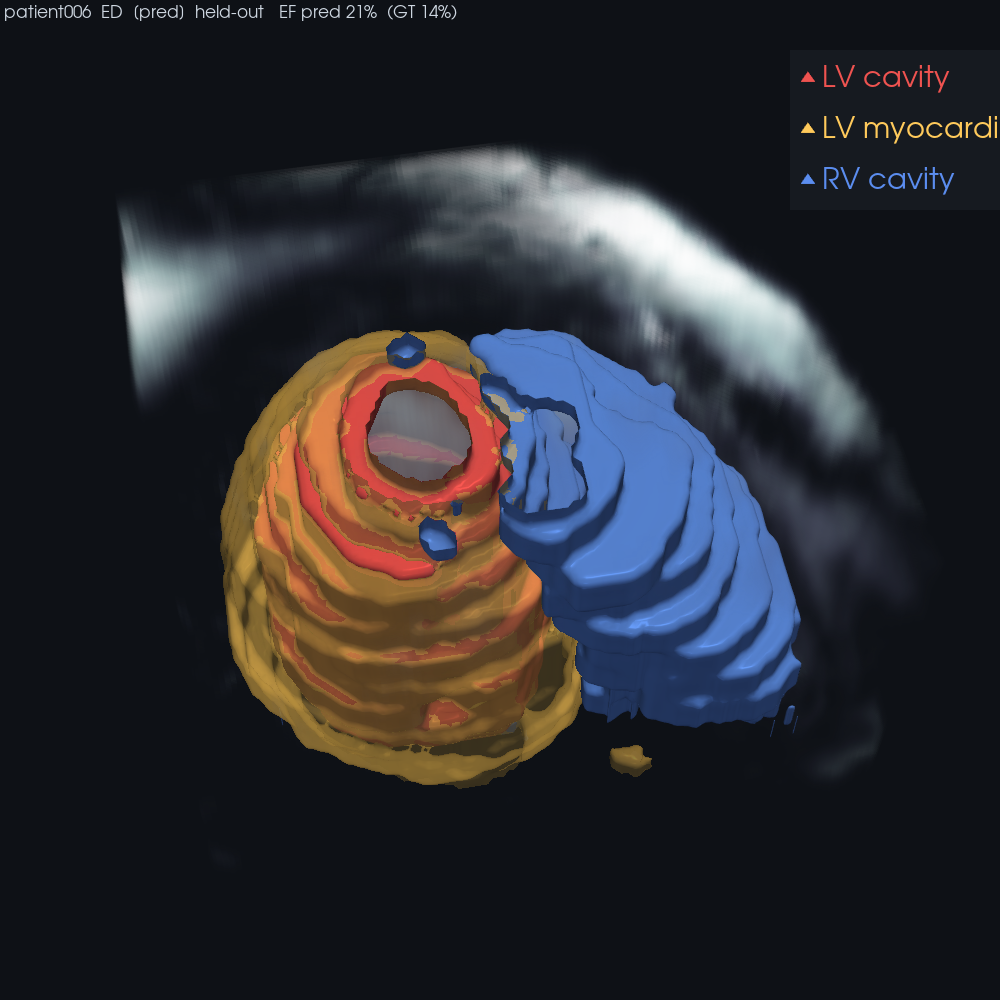

# cardioview

3D visualization of ACDC cardiac MRI and the segmentation model's results — a demo /
inference view of the [`cardioseg`](../cardioseg) pipeline. Python + VTK (pyvista).

**Status: segmentation overlay.** Colored chamber surfaces (LV cavity / myocardium / RV,
marching-cubes + Taubin smoothing) over a dim intensity raycast — **GT or the model's
prediction**, with ejection fraction (pred vs GT) in the title. Everything renders in the
model's preprocessed grid (in-plane 1.5 mm, square 256), so volume / GT / pred align with
no back-mapping.



*Held-out prediction (patient006, EF pred 21% vs GT 14% — a hard low-EF case). Stray
specks are real false positives — honest model behavior, not cleaned up.*

**Honesty:** `--source pred` checks the deterministic train/val split and labels the frame
`held-out` or `TRAIN-seen` (+ warns), so a prediction is never silently shown on data the
model trained on. The 20 held-out patients are the only fair ones to judge the model by.

Earlier step — raw intensity raycast (no seg) via `render_volume.py`; cine-MRI intensity is
murky by nature (crisp volume renders are usually CT or seg-based), which is why the overlay
is the real view.

## Run
```bash
# from the repo root, in the env that has cardioseg + pyvista
PYTHONPATH=. python cardioview/render_overlay.py --patient patient006 --phase ED --source pred
#   --source gt   ground-truth masks   ·   --phase ED|ES   ·   --model acdc|acdc_aug
#   --interactive rotatable window     ·   --margin MM     crop margin
# (use the pytorch_training_env python; conda run's inline wrapper is flaky here, call the
#  env python.exe directly: C:/Users/User/miniconda3/envs/pytorch_training_env/python.exe)
```
Reads ACDC from `CARDIAC_DATA_ROOT` (default `D:/data/raw/mri/acdc`); data stays outside
the repo (licensing).

## Planned
- EF pred-vs-GT validation table + a gallery over the 20 held-out patients (worst cases first)
- ED/ES side-by-side (the EF squeeze)
- Optional web export

Tracked in beads (`bd show cardiac-seg-0tg`).
