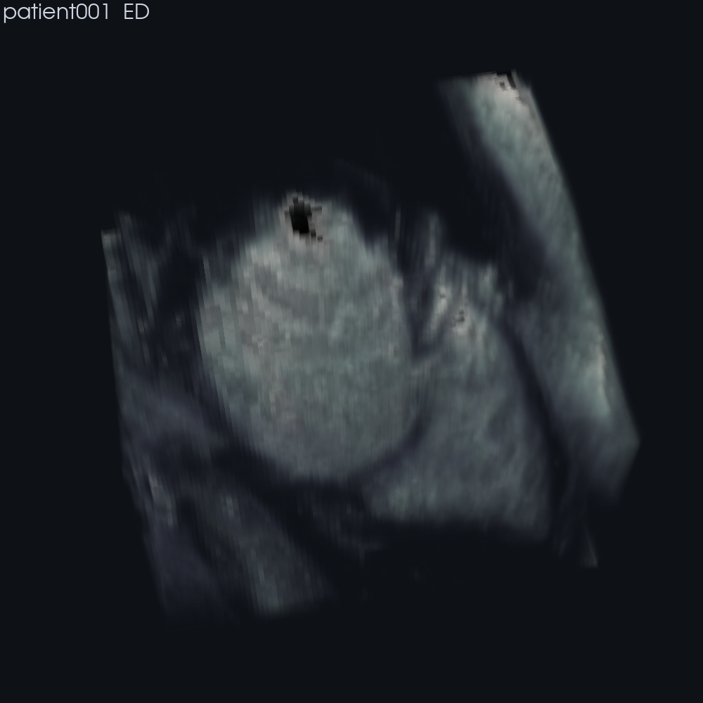

# cardioview

3D visualization of ACDC cardiac MRI and the segmentation model's results — a demo /
inference view of the [`cardioseg`](../cardioseg) pipeline. Python + VTK (pyvista).

**Status: volume raycast.** True GPU volume rendering of an ACDC MRI frame, spacing-aware
(ACDC stacks are ~6–7× anisotropic — z ≈ 10 mm vs ~1.5 mm in-plane — so the volume is
resampled to isotropic with SciPy first) and cropped to the heart ROI (bounding box of the
label mask + margin) so it shows the heart, not the whole chest.



> Raw cine-MRI intensity renders murky by nature (the crisp volume renders you usually see
> are CT or segmentation-based). Chamber structure pops once the segmentation is overlaid —
> that's the next step.

## Run
```bash
# from the repo root, in the env that has cardioseg + pyvista
PYTHONPATH=. conda run -n pytorch_training_env \
  python cardioview/render_volume.py --patient patient001 --phase ED
# --interactive  open a window  ·  --no-crop full FOV  ·  --margin MM  ·  --phase ED|ES
```
Reads ACDC from `CARDIAC_DATA_ROOT` (default `D:/data/raw/mri/acdc`); data stays outside
the repo (licensing).

## Planned
- Segmentation overlay (predicted chambers colored over the volume)
- Marching-cubes chamber surfaces (LV cavity / myocardium / RV)
- EF pred-vs-GT validation per heart + a gallery over many patients

Tracked in beads (`bd show cardiac-seg-0tg`).
